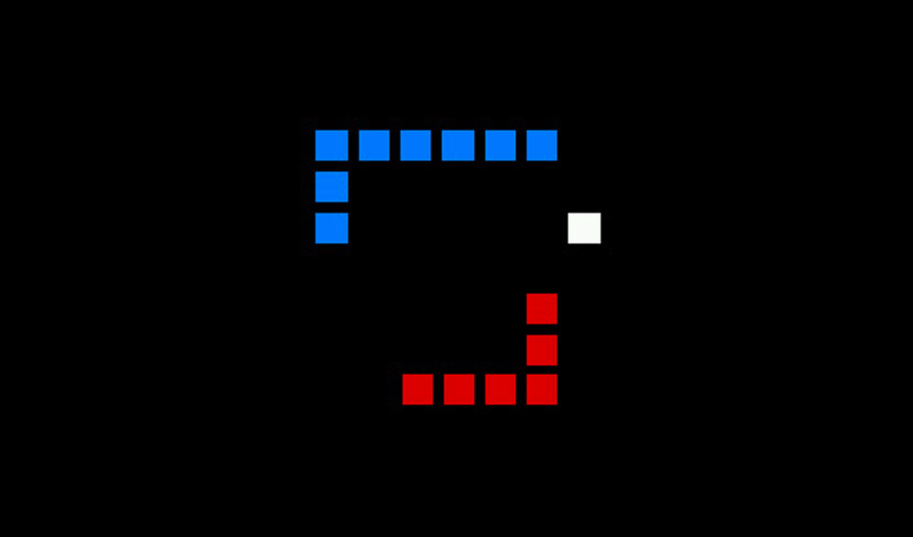
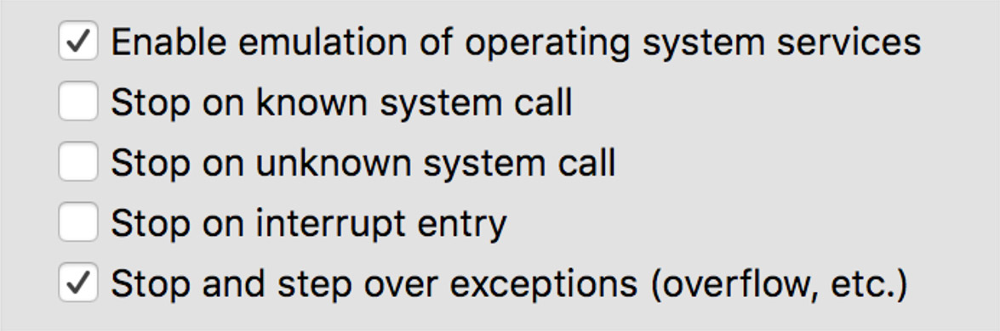

# assembly-snake

Two-player Snake game written in assembly language. Designed for the MIPS CPU architecture. The entire game can be found in the [assembly-snake.S](assembly-snake.S) file. Thanks to [QTMips Online](https://comparch.edu.cvut.cz/qtmips/app/), you can try it out even in a web browser.

## Running the Game

The game can be run using the QtMips tool, both in its [standard form](https://github.com/cvut/QtMips) and in the [web version](https://comparch.edu.cvut.cz/qtmips/app/).
Set the QtMips options to correspond with the text below. Then, simply compile the file with the code and run it.

#### QtMips Basic Options

- No pipeline, no cache
- Delay slot ON

#### QtMips OS Emulation Options

## Game Behavior

- _assembly-snake_ features two manually controlled snakes:
  - **RED SNAKE** is controlled by:
    - The red RGB knob or `WSAD` keys
  - **BLUE SNAKE** is controlled by:
    - The blue RGB knob or `IKJL` keys
- On Game Over, the game intentionally breaks; please recompile to play again.
- For food positions, pre-generated "random" positions are used. Optionally, the player can make the game more random by entering a `1-10` integer in the `OPTIONAL_NUMBER` constant at the start of the code (this changes the pre-generated positions).

## Key Methods

For more detailed information, see the comments in the code.

#### `drawPoint(address, color)`
- A method with a nested for-loop that draws an 8x8 pixel square in the given color at the specified address.

#### `drawSnake(length, address, direction, color)`
- Draws the two snakes at initialization. Returns the snake’s head (`$a1`) and tail (`$a2`).

#### `updateSnake(head, tail, snakeNumber, color, direction)`
- Moves the snake by adding a new head and removing the old tail.
  - Includes collision detection, extension when eating food, and more.
  - Returns the updated head (`$a1`) and tail (`$a2`).

#### `checkChange(tail, snakeNumber)`
- Used inside `updateSnake()` to determine where the tail goes next.
  - The addresses where the snake changes direction are saved in an array.
  - This method looks for the (old) tail in the array to check if that is where the snake changed direction.

#### `mainLoop()`
- The **core game loop** that:
  - Calls `updateSnake()` for both snakes.
  - Checks and validates input from the keyboard and knobs.
